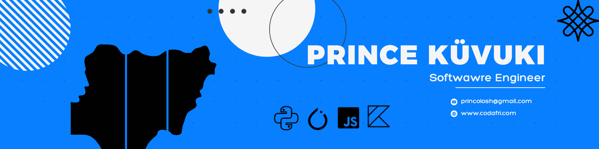

# Hi there, I'm Prince Küvuki 👋

### Software Engineer • AI/ML Practitioner • Mobile Developer

## 🚀 About Me

I'm a software engineer with 7+ years of experience crafting digital solutions across multiple platforms. I thrive at the intersection of creativity and technology, building applications that are both functional and elegant.

- 🔭 Currently working with: **Next.js, Python, PyTorch, Jetpack Compose**
- 🌱 Exploring: **AI/ML integration and advanced mobile architectures**
- 💼 Previous experience: **PHP, SvelteKit, TensorFlow, Flutter**
- 🎯 Passionate about: **Clean code, intuitive UX, and scalable systems**

## 🛠️ Technical Arsenal

### Frontend & Web

### AI & Machine Learning

### Mobile Development

### Tools & Platforms

## 📫 Let's Connect

---

*"First, solve the problem. Then, write the code."* - John Johnson

